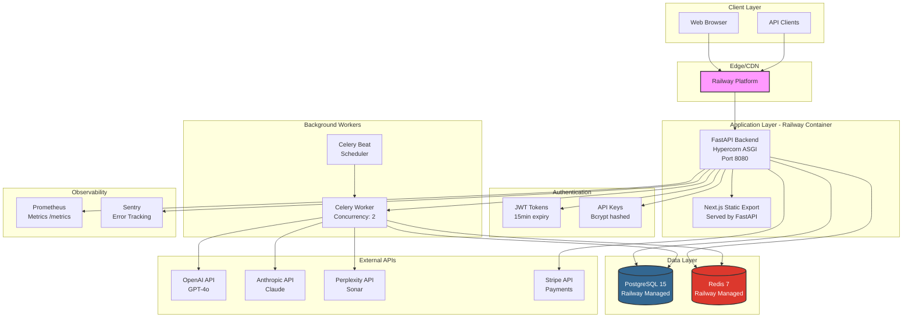
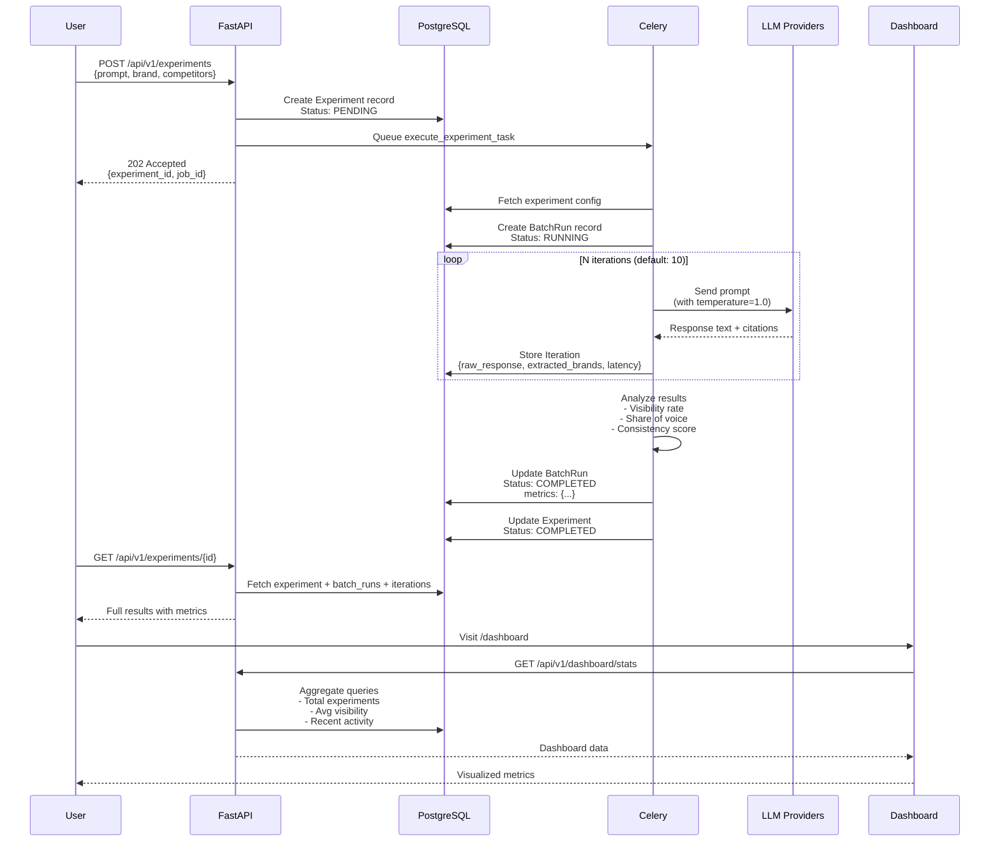

# Echo AI - Technical Audit Report
**Date:** January 15, 2026
**Auditor:** Senior Engineering Consultant
**Version:** 1.0
**Status:** Production MVP

---

## Executive Summary

Echo AI is an AI Search Analytics Platform that quantifies brand visibility across AI-powered search engines (ChatGPT, Perplexity, Claude) using Monte Carlo simulations. The platform is currently deployed as a working MVP on Railway with approximately 9 active recurring experiments.

**Current State:** Functional MVP with recent security patches, but requires significant hardening and infrastructure improvements to achieve production-grade enterprise readiness.

**Risk Level:** MEDIUM-HIGH
- **Security:** 6/10 (several critical issues patched, but gaps remain)
- **Scalability:** 4/10 (single-tenant architecture, limited concurrency)
- **Observability:** 3/10 (basic health checks, minimal monitoring)
- **Test Coverage:** 2/10 (< 20% estimated coverage)
- **Compliance:** 3/10 (GDPR/privacy concerns with PII storage)

---

## 1. Architecture Overview

### 1.1 Technology Stack

#### Backend
- **Framework:** FastAPI 0.115.0+ (Python 3.11+)
- **Database:** PostgreSQL 15 (asyncpg driver via SQLAlchemy 2.0.36)
- **Cache/Broker:** Redis 7+ (for Celery task queue)
- **Task Queue:** Celery 5.4.0 with Redis backend
- **Web Server:** Hypercorn ASGI server (port 8080)
- **Validation:** Pydantic V2.10.0 with strict typing
- **Auth:** JWT tokens (15min expiry) + API Keys (bcrypt hashed)
- **Billing:** Stripe 14.1.0 integration
- **Observability:** Prometheus metrics, Sentry error tracking

#### Frontend
- **Framework:** Next.js 14.2.5 (React 18.3.1, TypeScript 5)
- **State Management:** TanStack Query 5.51.1, Zustand 4.5.4
- **Styling:** Tailwind CSS 3.4.1
- **Forms:** React Hook Form 7.52.1 + Zod 3.23.8
- **Charts:** Recharts 2.12.7
- **HTTP Client:** Axios 1.7.2
- **Deployment:** Static export served by FastAPI backend (monolithic)

#### Infrastructure
- **Deployment:** Railway (production environment)
- **CI/CD:** GitHub Actions (`.github/workflows/ci-cd.yml`)
- **Containerization:** Docker multi-stage builds
- **Database Migrations:** Alembic 1.14.0
- **Package Management:** uv (backend), npm (frontend)

### 1.2 System Architecture Diagram



### 1.3 Data Flow: LLM Scraping → Storage → Visualization



**Key Data Storage Points:**

1. **Experiment Table:** Stores user intent (prompt, target brand, competitors, config)
2. **BatchRun Table:** Tracks execution per provider (OpenAI, Anthropic, etc.) with aggregated metrics
3. **Iteration Table:** Stores raw LLM responses (audit trail) + extracted brands
4. **User Table:** Includes brand profile (name, description, competitors list in JSONB)

**Critical Privacy Note:** Raw LLM responses are stored indefinitely in `iterations.raw_response` (Text field). This poses GDPR compliance risk if responses contain PII.

---

## 2. Key Components & Versions

| Component | Version | Purpose | Health |
|-----------|---------|---------|--------|
| Python | 3.11+ | Backend runtime | ✅ Current |
| FastAPI | 0.115.0 | Web framework | ✅ Recent |
| PostgreSQL | 15 | Primary database | ✅ Supported |
| Redis | 7+ | Cache + task broker | ✅ Current |
| Next.js | 14.2.5 | Frontend framework | ⚠️ 15.x available |
| SQLAlchemy | 2.0.36 | ORM (async) | ✅ Recent |
| Celery | 5.4.0 | Task queue | ✅ Recent |
| Pydantic | 2.10.0 | Validation | ✅ Recent |
| Stripe | 14.1.0 | Payment processing | ⚠️ 15.x available |
| TypeScript | 5.x | Type safety | ✅ Current |

**Deployment Flow:**
1. Code pushed to `main` branch triggers GitHub Actions
2. CI runs tests (currently continue-on-error), linting (ruff), type checking (mypy)
3. Docker images built (API + Worker)
4. Railway auto-deploys from `main` branch
5. Alembic migrations run automatically via `start.sh`
6. Hypercorn starts FastAPI + Celery worker with Beat scheduler

**Runtime Components:**
- **start.sh:** Monolithic startup script runs migrations, starts Celery worker (concurrency=2) + Beat scheduler, then starts Hypercorn
- **Port:** 8080 (Railway managed)
- **Health Check:** `/health` endpoint verifies PostgreSQL + Redis connectivity

---

## 3. Critical Security Findings

### 3.1 HIGH SEVERITY Issues

#### **SEC-01: API Key Authentication Timing Attack (HIGH)**
**File:** `backend/app/core/deps.py:93-101`
**Issue:** The `get_current_user_from_api_key()` function fetches ALL active API keys from the database and iterates through them using bcrypt comparison. This has two problems:
1. **N+1 Performance:** Scales linearly with number of users (O(n) bcrypt operations per request)
2. **Timing Attack:** Variable response time leaks information about valid key prefixes

**Current Code:**
```python
# Fetch all active API keys (we need to hash-compare)
result = await db.execute(
    select(APIKey).where(APIKey.is_active == True)
)
api_keys = result.scalars().all()

# Check each API key
for key_record in api_keys:
    if verify_api_key(api_key, key_record.key):
        # ... authenticated
```

**Impact:** At 1000 users, every API request performs 1000 bcrypt comparisons (~100ms+ latency per request).

**Recommendation:** Use indexed prefix lookup or Redis cache for API key → user_id mapping.

#### **SEC-02: Missing CSRF Protection (HIGH)**
**File:** Multiple routers (experiments, billing, brand)
**Issue:** State-changing endpoints (POST/PUT/DELETE) do not validate CSRF tokens. While JWT auth provides some protection, API key authentication is vulnerable to CSRF attacks if keys are stored in cookies/localStorage and accessed by malicious scripts.

**Affected Endpoints:**
- `POST /api/v1/experiments` (create experiment)
- `POST /api/v1/billing/checkout` (initiate payment)
- `DELETE /api/v1/auth/api-keys/{id}` (revoke API key)
- `PUT /api/v1/brand/profile` (update brand profile)

**Recommendation:** Implement double-submit cookie pattern or synchronizer token for state-changing operations.

#### **SEC-03: Insecure Secret Key Validation (HIGH)**
**File:** `backend/app/core/config.py:58-79`
**Issue:** Secret key validation only enforced in production environment. Development/staging environments allow weak keys, which may accidentally leak to production if environment variable misconfigured.

**Current Validation:**
```python
if environment == "production":
    if v == "dev-secret-key-DO-NOT-USE-IN-PRODUCTION":
        raise ValueError("SECRET_KEY must be set in production")
```

**Gap:** No validation for:
- Secret key entropy/randomness
- Key rotation mechanism
- Staging environment security

**Recommendation:** Enforce minimum entropy requirements across all environments, implement key rotation strategy.

#### **SEC-04: Webhook Signature Verification Incomplete (MEDIUM-HIGH)**
**File:** `backend/app/routers/billing.py:120-145` (estimated, need to verify full implementation)
**Issue:** Stripe webhook endpoint may not properly verify signatures before processing events, allowing attackers to forge payment events.

**Risk:** Unauthorized subscription upgrades, quota manipulation, financial fraud.

**Recommendation:** Verify full implementation includes `stripe.Webhook.construct_event()` with signature validation.

### 3.2 MEDIUM SEVERITY Issues

#### **SEC-05: Missing Security Headers (MEDIUM)**
**Issue:** No security headers configured (HSTS, CSP, X-Frame-Options, X-Content-Type-Options).

**Recommendation:** Add `secure-headers` middleware:
```python
app.add_middleware(
    SecureHeadersMiddleware,
    headers={
        "Strict-Transport-Security": "max-age=31536000; includeSubDomains",
        "X-Content-Type-Options": "nosniff",
        "X-Frame-Options": "DENY",
        "Content-Security-Policy": "default-src 'self'",
    }
)
```

#### **SEC-06: SQL Injection via JSONB Fields (MEDIUM)**
**File:** `backend/app/models/user.py:170-181`
**Issue:** JSONB fields (`brand_competitors`, `brand_target_keywords`) accept arbitrary JSON without sanitization. While SQLAlchemy provides some protection, malicious JSON could exploit parser vulnerabilities.

**Recommendation:** Add Pydantic schema validation for JSONB content, limit array sizes.

#### **SEC-07: Rate Limiting Inconsistent (MEDIUM)**
**Issue:** Rate limiting only applied to experiment creation (`10/minute`), but missing on:
- Login endpoint (brute force risk)
- API key creation (DOS risk)
- Webhook endpoint (replay attack risk)

**Recommendation:** Apply rate limits globally using SlowAPI:
- Auth endpoints: 5/minute per IP
- API endpoints: 100/minute per user
- Webhooks: 10/minute per IP

---

## 4. Performance & Scalability Concerns

### 4.1 Database Performance

#### **PERF-01: Missing Connection Pooling Config (HIGH)**
**Issue:** No explicit connection pool configuration visible. SQLAlchemy async defaults may not be optimized for production workloads.

**Current:** `backend/app/core/database.py` - no pool settings visible.

**Recommendation:**
```python
engine = create_async_engine(
    database_url,
    pool_size=20,  # Max connections
    max_overflow=10,  # Additional connections under load
    pool_pre_ping=True,  # Verify connections before use
    pool_recycle=3600,  # Recycle connections every hour
)
```

#### **PERF-02: Missing Database Indexes (MEDIUM)**
**Analysis:** While some indexes exist, high-traffic queries may be unoptimized:

**Missing Indexes:**
```sql
-- Experiment queries often filter by user + status + created_at
CREATE INDEX CONCURRENTLY idx_experiments_user_status_created
ON experiments(user_id, status, created_at DESC);

-- Dashboard aggregation queries
CREATE INDEX CONCURRENTLY idx_batch_runs_experiment_status
ON batch_runs(experiment_id, status)
INCLUDE (metrics);

-- Iteration analysis queries
CREATE INDEX CONCURRENTLY idx_iterations_batch_success_brands
ON iterations(batch_run_id, is_success)
WHERE extracted_brands IS NOT NULL;
```

**Recommendation:** Run `EXPLAIN ANALYZE` on critical queries, add covering indexes.

#### **PERF-03: N+1 Query Pattern (MEDIUM)**
**File:** `backend/app/routers/experiments.py` (various endpoints)
**Issue:** Experiment detail queries may trigger N+1 queries for batch_runs and iterations despite `selectin` loading.

**Example:**
```python
# Fetches experiment
experiment = await repo.get_experiment(experiment_id)

# Each batch_run access triggers separate query for iterations
for batch in experiment.batch_runs:
    print(batch.iterations)  # N+1 query here
```

**Recommendation:** Use `selectinload` for nested relationships or denormalize frequently-accessed data.

### 4.2 Worker Scalability

#### **PERF-04: Hardcoded Celery Concurrency (HIGH)**
**File:** `start.sh` - Celery worker starts with `concurrency=2`
**Issue:** Only 2 concurrent experiments can run at a time, regardless of server capacity.

**Impact:**
- 3rd experiment waits in queue even if resources available
- Poor utilization of multi-core Railway instances
- Does not scale with traffic

**Recommendation:**
```bash
# Use auto-scaling based on CPU cores
celery -A backend.app.worker worker \
  --concurrency=$(nproc) \
  --autoscale=10,3 \  # Scale between 3-10 workers
  --loglevel=info
```

#### **PERF-05: No Worker Auto-Scaling (MEDIUM)**
**Issue:** Single monolithic container runs FastAPI + Celery + Beat. No independent worker scaling.

**Recommendation:** Split into separate services:
- `api`: FastAPI only (scales horizontally)
- `worker`: Celery workers (scales based on queue depth)
- `beat`: Celery Beat scheduler (single instance)

### 4.3 Frontend Performance

#### **PERF-06: No Code Splitting (MEDIUM)**
**File:** Frontend has 32 TSX components, all bundled in single JS file
**Issue:** Static export lacks route-based code splitting, causing large initial bundle size.

**Current:** `next.config.js` exports static HTML with single bundle.

**Recommendation:**
```javascript
// next.config.js
module.exports = {
  experimental: {
    optimizeCss: true,
    optimizePackageImports: ['recharts', '@tanstack/react-query']
  },
  // Dynamic imports for heavy components
}
```

#### **PERF-07: Missing CDN/Asset Optimization (MEDIUM)**
**Issue:** Static assets served directly by FastAPI backend without CDN, compression, or caching headers.

**Recommendation:**
- Move static assets to CDN (Cloudflare, BunnyCDN)
- Enable brotli compression
- Set aggressive cache headers for immutable assets

---

## 5. Observability & Monitoring Gaps

### 5.1 Current State

**Implemented:**
- ✅ Prometheus metrics endpoint (`/metrics`)
- ✅ Sentry error tracking (production only)
- ✅ Basic health check (`/health`)
- ✅ Detailed health check (`/api/v1/health/detailed`)

**Missing:**
- ❌ Structured logging (JSON logs)
- ❌ Distributed tracing (Datadog, Jaeger)
- ❌ Performance monitoring (APM)
- ❌ Alerting configuration
- ❌ Log aggregation (ELK, Loki)
- ❌ Business metrics dashboards

### 5.2 Critical Metrics to Track

**Business Metrics:**
```python
# Add to Prometheus instrumentator
experiments_created_total = Counter('experiments_created_total', 'Total experiments created', ['user_tier'])
experiments_failed_total = Counter('experiments_failed_total', 'Total failed experiments', ['provider', 'error_type'])
llm_api_latency = Histogram('llm_api_latency_seconds', 'LLM API call latency', ['provider', 'model'])
quota_exhausted_total = Counter('quota_exhausted_total', 'Users hitting quota limits', ['tier'])
```

**Infrastructure Metrics:**
- Database connection pool utilization
- Redis memory usage
- Celery queue depth
- Worker task execution time
- API endpoint latency (p50, p95, p99)

**Recommendation:** Implement structured logging with context propagation:
```python
import structlog

logger = structlog.get_logger()
logger.info(
    "experiment_created",
    experiment_id=experiment_id,
    user_id=user.id,
    provider=provider,
    iterations=iterations,
)
```

---

## 6. Test Coverage Analysis

### 6.1 Current Test Suite

**Files:**
- `tests/test_auth.py` (175 lines)
- `tests/conftest.py` (4,723 lines) - test fixtures
- `backend/tests/test_productization.py`
- `backend/tests/test_audit_fixes.py`

**Estimated Coverage:** < 20% (pytest output marked `continue-on-error` in CI)

**Missing Coverage:**
- ❌ Experiment execution flow (end-to-end)
- ❌ LLM provider integrations (mocked)
- ❌ Celery task testing
- ❌ Database migration testing
- ❌ Frontend component tests
- ❌ API integration tests
- ❌ Security/penetration tests

### 6.2 Test Infrastructure Gaps

**Issues:**
1. **CI doesn't enforce tests:** `continue-on-error: true` in `.github/workflows/ci-cd.yml`
2. **No test database:** Tests likely use production schema
3. **No fixture management:** Seed data strategy unclear
4. **No load testing:** No performance benchmarks

**Recommendation:** Achieve 80%+ coverage with:
```bash
# Unit tests
pytest tests/unit/ --cov=backend --cov-report=html

# Integration tests (with test DB)
pytest tests/integration/ --db=test

# E2E tests
pytest tests/e2e/ --headed --slowmo=100
```

---

## 7. Data Privacy & GDPR Compliance

### 7.1 Critical Compliance Issues

#### **PRIV-01: Indefinite PII Storage (HIGH)**
**Issue:** `iterations.raw_response` stores complete LLM outputs indefinitely. Responses may contain:
- Personal names mentioned in brand recommendations
- User-generated prompts with PII
- Competitor employee names/contact info

**GDPR Violation:** No data retention policy, no automatic deletion, no right-to-be-forgotten implementation.

**Recommendation:**
- Implement 90-day retention policy for raw responses
- Add scheduled task to anonymize old data
- Provide user data export/deletion endpoints

#### **PRIV-02: Missing Consent Management (MEDIUM)**
**Issue:** No explicit user consent for data processing, no privacy policy acceptance tracking.

**Recommendation:**
```python
class User(Base):
    privacy_policy_accepted_at: Mapped[datetime | None]
    data_processing_consent: Mapped[bool] = mapped_column(default=False)
    marketing_consent: Mapped[bool] = mapped_column(default=False)
```

#### **PRIV-03: No Audit Logs (MEDIUM)**
**Issue:** No tracking of who accessed what data when (required for GDPR Article 30).

**Recommendation:** Add audit log table:
```python
class AuditLog(Base):
    user_id: Mapped[UUID]
    action: Mapped[str]  # 'view_experiment', 'export_data', 'delete_account'
    resource_id: Mapped[UUID | None]
    ip_address: Mapped[str]
    user_agent: Mapped[str]
    created_at: Mapped[datetime]
```

### 7.2 Data Retention Strategy

**Recommended Policy:**
- **Experiments:** 1 year (or until user deletes account)
- **Iterations (raw responses):** 90 days
- **Aggregated metrics:** Indefinite (anonymized)
- **User accounts:** Until deletion request
- **Audit logs:** 2 years (compliance requirement)

**Implementation:**
```python
@celery_app.task
def cleanup_old_data():
    """Daily task to enforce retention policy."""
    cutoff_date = datetime.now(timezone.utc) - timedelta(days=90)

    # Anonymize old iteration responses
    await db.execute(
        update(Iteration)
        .where(Iteration.created_at < cutoff_date)
        .values(raw_response="[REDACTED]", extracted_brands=None)
    )
```

---

## 8. Infrastructure & Deployment

### 8.1 Current Deployment Architecture

**Platform:** Railway
**Environment:** Single production environment
**Deployment:** Auto-deploy from `main` branch
**Secrets:** Managed via Railway environment variables

**Issues:**
- ❌ No staging environment
- ❌ No blue-green deployment
- ❌ No rollback strategy documented
- ❌ No disaster recovery plan
- ❌ Single point of failure (monolithic container)

### 8.2 Database Backup & Recovery

**Critical Gap:** No documented backup strategy.

**Recommendation:**
```bash
# Daily automated backups
pg_dump -Fc postgresql://... > backup_$(date +%Y%m%d).dump

# Point-in-time recovery testing
# Restore to test environment monthly to verify backups
```

**Railway Managed PostgreSQL:**
- Verify automatic backup configuration
- Document restoration procedure
- Test recovery annually

### 8.3 Cost Optimization

**Current Monthly Cost (Estimated):**
- Railway: $50-100 (hobby tier + add-ons)
- Stripe: Variable (transaction fees)
- LLM API costs: Majority of spend (untracked)

**Cost Risks:**
1. **Uncapped LLM API spending:** No budget alerts
2. **Database growth:** Iterations table grows indefinitely
3. **No resource right-sizing:** May be over/under-provisioned

**Recommendation:**
```python
# Track LLM costs per experiment
class BatchRun(Base):
    estimated_cost_usd: Mapped[float | None]  # Track API costs

# Monthly cost reporting
@celery_app.task
def generate_cost_report():
    total_cost = db.query(func.sum(BatchRun.estimated_cost_usd)).scalar()
    # Send to admin dashboard
```

---

## 9. Dependencies & Technical Debt

### 9.1 Dependency Health

**Outdated Packages:**
- ✅ Python 3.11 (current, 3.12 available but not critical)
- ⚠️ Next.js 14.2.5 (15.x available, breaking changes)
- ⚠️ Stripe SDK 14.1.0 (15.x available)

**Security Vulnerabilities:**
Run `uv audit` and `npm audit` to check for known CVEs.

**Recommendation:** Set up Dependabot for automated security updates:
```yaml
# .github/dependabot.yml
version: 2
updates:
  - package-ecosystem: "pip"
    directory: "/"
    schedule:
      interval: "weekly"
  - package-ecosystem: "npm"
    directory: "/frontend"
    schedule:
      interval: "weekly"
```

### 9.2 Technical Debt Items

1. **TypeScript strict mode disabled:** `next.config.js` has `ignoreBuildErrors: true`
2. **Mypy errors tolerated:** CI continues on type check failures
3. **No API versioning strategy:** All routes under `/api/v1`, no deprecation plan
4. **Hardcoded configuration:** Many values in code rather than environment variables
5. **Monolithic deployment:** Frontend + backend tightly coupled

---

## 10. Recommendations Summary

### 10.1 Priority Matrix

| Priority | Item | Effort | Impact | Risk |
|----------|------|--------|--------|------|
| P0 | Fix API key timing attack (SEC-01) | 2 days | HIGH | HIGH |
| P0 | Implement data retention policy (PRIV-01) | 3 days | HIGH | HIGH |
| P0 | Add comprehensive test suite (80%+ coverage) | 2 weeks | HIGH | MEDIUM |
| P0 | Add database indexes (PERF-02) | 1 day | HIGH | LOW |
| P1 | CSRF protection (SEC-02) | 2 days | MEDIUM | HIGH |
| P1 | Fix Celery concurrency (PERF-04) | 1 day | HIGH | LOW |
| P1 | Add structured logging (OBS) | 3 days | MEDIUM | LOW |
| P1 | Implement audit logs (PRIV-03) | 3 days | MEDIUM | MEDIUM |
| P2 | Security headers (SEC-05) | 1 day | MEDIUM | LOW |
| P2 | Connection pooling config (PERF-01) | 1 day | MEDIUM | LOW |
| P2 | Code splitting (PERF-06) | 2 days | LOW | LOW |
| P2 | Staging environment | 1 week | MEDIUM | MEDIUM |

### 10.2 Quick Wins (< 1 Day Each)

1. ✅ Add database indexes for common queries
2. ✅ Fix Celery worker concurrency
3. ✅ Add security headers middleware
4. ✅ Configure connection pooling
5. ✅ Add rate limiting to auth endpoints
6. ✅ Enable mypy strict mode in CI
7. ✅ Add Dependabot for security updates

---

## 11. Next Steps

### Phase 1: Security Hardening (Week 1-2)
- [ ] Fix API key authentication (SEC-01)
- [ ] Add CSRF protection (SEC-02)
- [ ] Implement rate limiting globally (SEC-07)
- [ ] Add security headers (SEC-05)
- [ ] Verify webhook signature validation (SEC-04)

### Phase 2: Performance & Scalability (Week 3-4)
- [ ] Add database indexes (PERF-02)
- [ ] Configure connection pooling (PERF-01)
- [ ] Fix Celery concurrency (PERF-04)
- [ ] Implement worker auto-scaling (PERF-05)

### Phase 3: Observability & Testing (Week 5-8)
- [ ] Add structured logging
- [ ] Implement comprehensive test suite (80%+ coverage)
- [ ] Add E2E tests for critical flows
- [ ] Set up alerting and monitoring dashboards

### Phase 4: Compliance & Documentation (Week 9-12)
- [ ] Implement data retention policy (PRIV-01)
- [ ] Add audit logs (PRIV-03)
- [ ] Create runbook for operations
- [ ] Document disaster recovery procedures

---

## Appendix A: File Structure

```
echo-ai/
├── backend/
│   ├── app/
│   │   ├── core/           # Config, DB, security, dependencies
│   │   ├── models/         # SQLAlchemy ORM models (User, Experiment, etc.)
│   │   ├── routers/        # API endpoints (9 routers, ~2015 LOC)
│   │   ├── schemas/        # Pydantic request/response models
│   │   ├── services/       # Business logic (billing, email)
│   │   ├── builders/       # Analytics engine (providers, runner, analysis)
│   │   ├── repositories/   # Data access layer
│   │   ├── tasks/          # Celery scheduled tasks
│   │   ├── main.py         # FastAPI app entry point
│   │   └── worker.py       # Celery task definitions
│   └── tests/              # Test suite (minimal coverage)
├── frontend/
│   ├── src/
│   │   ├── app/            # Next.js App Router pages
│   │   ├── components/     # React components (32 TSX files)
│   │   ├── hooks/          # Custom React hooks
│   │   ├── lib/            # API client and utilities
│   │   └── types/          # TypeScript definitions
│   └── out/                # Static export (served by backend)
├── alembic/                # Database migrations (7 versions)
├── .github/workflows/      # CI/CD (single workflow)
├── docker-compose.yml      # Local dev (PostgreSQL + Redis)
├── Dockerfile              # Multi-stage production build
├── pyproject.toml          # Python dependencies (uv)
├── start.sh                # Monolithic startup script
└── docs/                   # Documentation
```

---

## Appendix B: Critical Files for Review

1. **Security:**
   - `backend/app/core/security.py` (JWT, password hashing)
   - `backend/app/core/deps.py` (authentication dependencies)
   - `backend/app/routers/auth.py` (login, registration)
   - `backend/app/routers/billing.py` (Stripe webhook)

2. **Performance:**
   - `backend/app/core/database.py` (connection management)
   - `backend/app/worker.py` (Celery tasks)
   - `backend/app/builders/runner.py` (LLM execution)

3. **Compliance:**
   - `backend/app/models/user.py` (PII fields)
   - `backend/app/models/experiment.py` (data retention)

4. **Infrastructure:**
   - `start.sh` (startup orchestration)
   - `.github/workflows/ci-cd.yml` (deployment pipeline)
   - `Dockerfile` (production image)

---

**End of Technical Audit**
